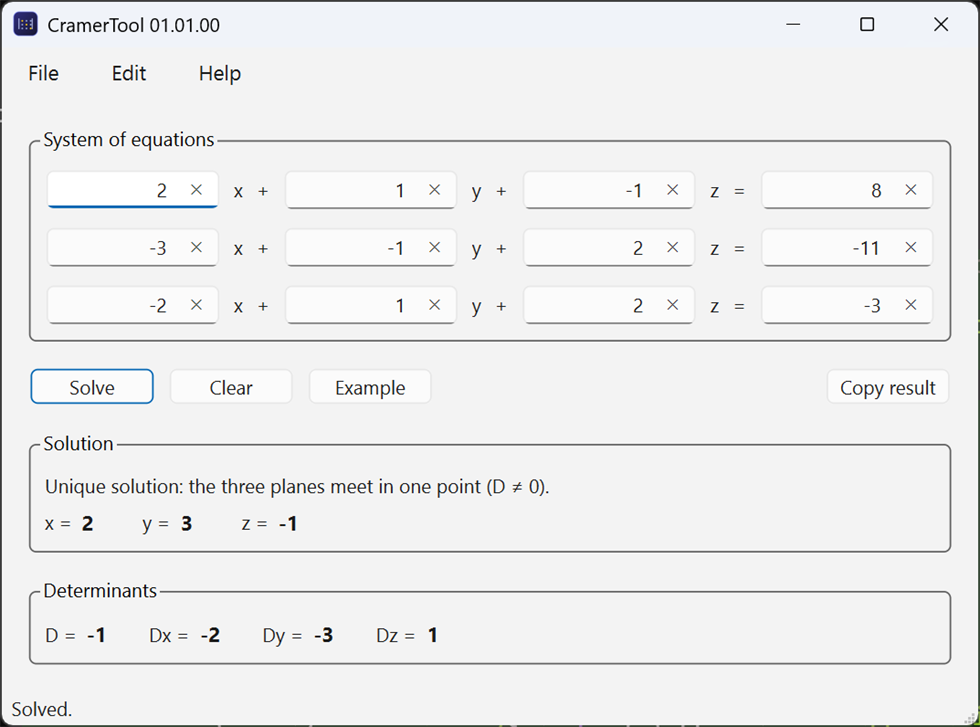
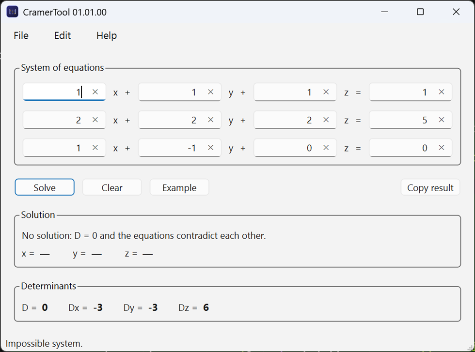
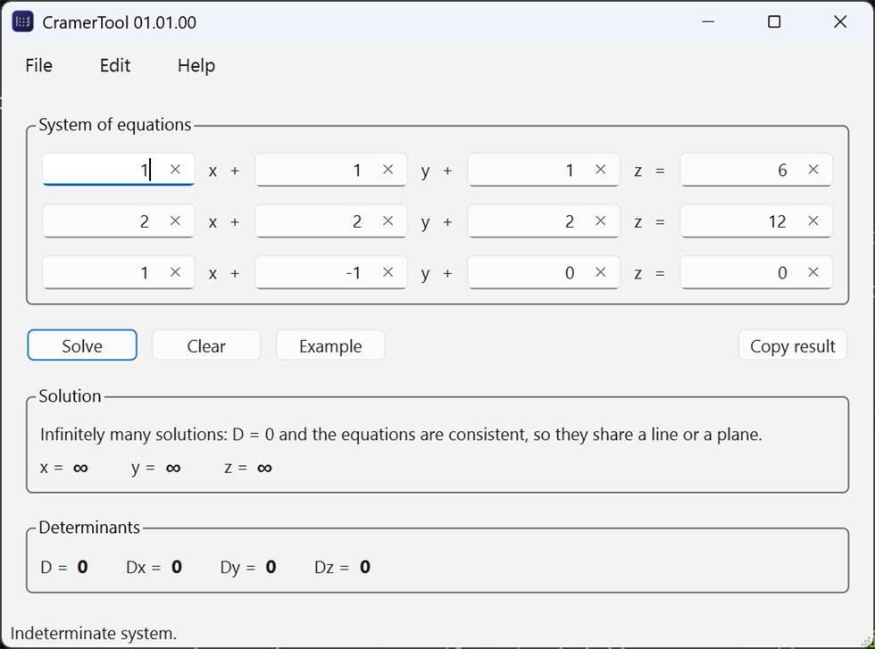
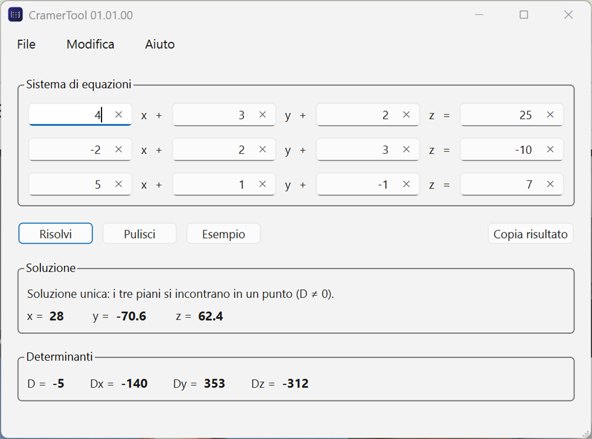

<div align="center">


# CramerTool

**Solve a 3×3 linear system, and see the determinants behind the answer.**
A small Qt 6 desktop tool that applies Cramer's rule — and, when the rule alone
is not enough, tells you *why* a system has no solution or infinitely many.

[](https://github.com/framunno/CramerTool/actions/workflows/ci.yml)
[](https://github.com/framunno/CramerTool/releases)
[](https://en.cppreference.com/w/cpp/20)
[](https://www.qt.io/)
[](LICENSE)



</div>

---

## What it does

Type the coefficients of

```
a₁x + b₁y + c₁z = d₁
a₂x + b₂y + c₂z = d₂
a₃x + b₃y + c₃z = d₃
```

press **Solve**, and CramerTool shows the solution together with the four
determinants it is built from: D, Dx, Dy and Dz. Seeing the intermediate values
is the point — it turns the answer into something you can check by hand.

## Highlights

- **Complete classification.** Not just "unique solution" or an error: a
  singular system is reported as *infinitely many solutions* or *no solution*,
  decided with the Rouché-Capelli theorem rather than the popular shortcut that
  gets it wrong (see [docs/MATH.md](docs/MATH.md)).
- **The determinants are shown**, so the result can be verified step by step.
- **Input that behaves.** Every field accepts plain or scientific notation,
  invalid entries are highlighted instead of silently producing a wrong answer,
  and Enter solves from anywhere in the form.
- **Numerically careful.** "Is this determinant zero?" is decided with a
  tolerance that scales with the size of the coefficients, so systems written in
  millions or in millionths behave the same.
- **Command line for demos and scripts**, keyboard shortcuts, result copied to
  the clipboard in one click.
- **English and Italian**, following the system language.
- **Tested and portable.** The solver is plain C++20 with no Qt dependency,
  covered by 15 unit tests; the Qt layer only reads fields and paints results.

## Screenshots

| Unique solution | No solution |
|---|---|
|  |  |
| D ≠ 0: x = Dx/D, y = Dy/D, z = Dz/D. | D = 0 and the equations contradict each other. Note that Dx, Dy and Dz are *not* all zero here. |

| Infinitely many solutions | Italian interface |
|---|---|
|  |  |
| D = 0 but the equations agree: the three planes share a line. | The interface follows the system language; English and Italian ship with the application. |

## Download and run

Download `CramerTool-01.01.00-win64.zip` from the
[releases page](https://github.com/framunno/CramerTool/releases), unzip it and
run `CramerTool.exe`. The archive already contains the Qt runtime, so nothing
needs to be installed.

To build it yourself — Qt 6.2 or newer and CMake 3.21 or newer:

```bash
cmake -S . -B build -DCMAKE_PREFIX_PATH="C:/Qt/6.11.1/mingw_64"
cmake --build build
ctest --test-dir build --output-on-failure
```

Full instructions, including Qt Creator, Visual Studio and packaging, are in
**[docs/BUILDING.md](docs/BUILDING.md)**.

## Command line

```bash
CramerTool --system="2,1,-1,8; -3,-1,2,-11; -2,1,2,-3" --solve
```

| Option | Meaning |
|---|---|
| `-s`, `--system="a,b,c,d; e,f,g,h; i,j,k,l"` | fill the form with a system (three rows of four numbers) |
| `--solve` | solve it immediately, without clicking |
| `--help`, `--version` | usage and version |

## How it works

For a system **A·v = b**, Cramer's rule replaces one column of **A** with **b**
at a time:

```
      | a₁ b₁ c₁ |          | d₁ b₁ c₁ |          | a₁ d₁ c₁ |          | a₁ b₁ d₁ |
D  =  | a₂ b₂ c₂ |   Dx  =  | d₂ b₂ c₂ |   Dy  =  | a₂ d₂ c₂ |   Dz  =  | a₂ b₂ d₂ |
      | a₃ b₃ c₃ |          | d₃ b₃ c₃ |          | a₃ d₃ c₃ |          | a₃ b₃ d₃ |
```

and, when D ≠ 0, gives x = Dx/D, y = Dy/D, z = Dz/D.

When D = 0 the rule says nothing, and the two remaining cases have to be told
apart by comparing the rank of the coefficient matrix with the rank of the
augmented matrix — which is what CramerTool does, by Gaussian elimination with
partial pivoting. The mathematics, including the counter-example that breaks the
usual shortcut, is written out in **[docs/MATH.md](docs/MATH.md)**.

## Project layout

```
src/core/     determinants, Cramer's rule, rank analysis   (plain C++20, no Qt)
src/ui/       the Qt window: fields, validation, results
src/app/      entry point, command line, generated version header
tests/        QTest suite for the solver
i18n/         translation files (en_US, it_IT)
resources/    application icon and Windows resource template
docs/         building, architecture, mathematics, screenshots
cmake/        version generation and warning flags
```

The separation is deliberate: the mathematics is testable without a GUI, and the
GUI never does arithmetic. See **[docs/ARCHITECTURE.md](docs/ARCHITECTURE.md)**.

## Documentation

| Document | Contents |
|---|---|
| [docs/BUILDING.md](docs/BUILDING.md) | Requirements, build, test, package, troubleshooting |
| [docs/ARCHITECTURE.md](docs/ARCHITECTURE.md) | Layers, data flow, design decisions |
| [docs/MATH.md](docs/MATH.md) | Cramer's rule, Rouché-Capelli, numerical tolerance |
| [CHANGELOG.md](CHANGELOG.md) | Version history |
| [THIRD_PARTY_NOTICES.md](THIRD_PARTY_NOTICES.md) | Qt and its LGPL obligations |

## License

MIT — see [LICENSE](LICENSE). Copyright © 2026 Francesco Ramunno.
Built with [Qt 6](https://www.qt.io/), used under the LGPL v3; see the
[third-party notices](THIRD_PARTY_NOTICES.md).

<div align="center">
<sub>Built by <a href="https://www.francescoramunno.it">Francesco Ramunno</a> ·
<a href="https://linkedin.com/in/francescoramunno">LinkedIn</a> ·
<a href="https://github.com/framunno">GitHub</a></sub>
</div>
